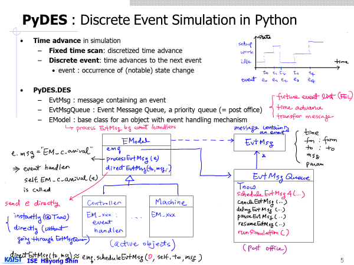
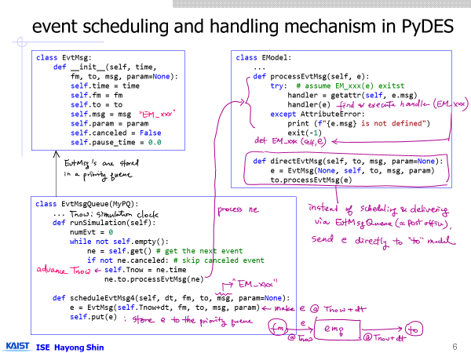
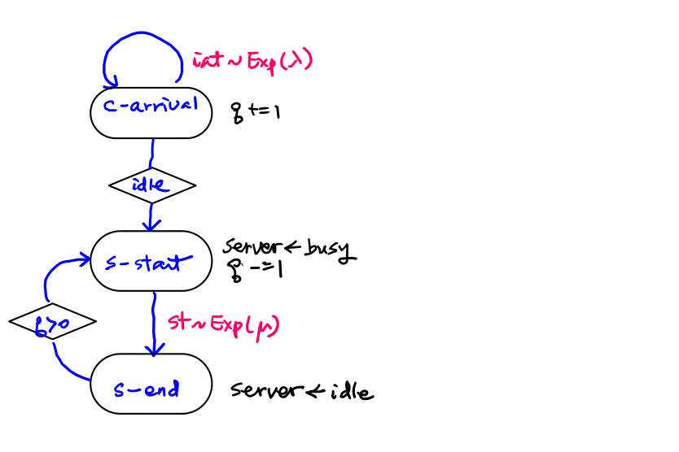
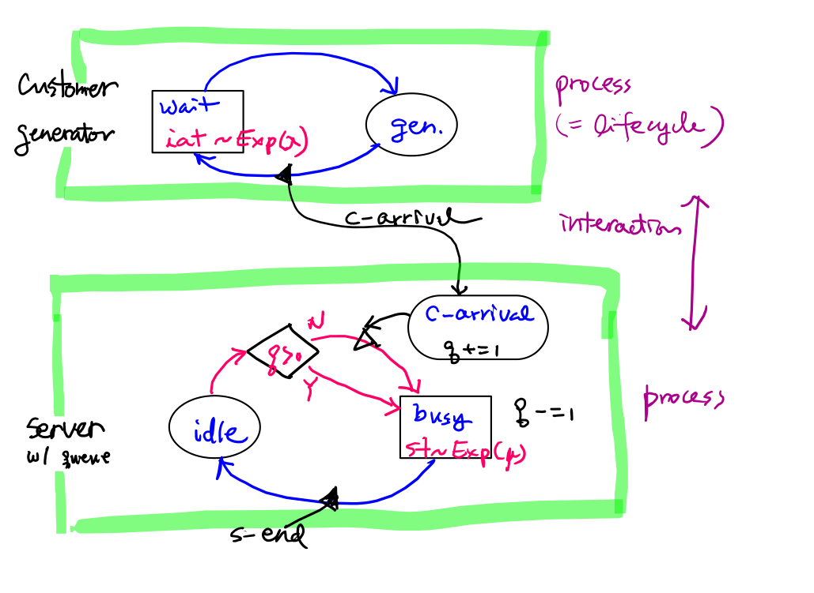
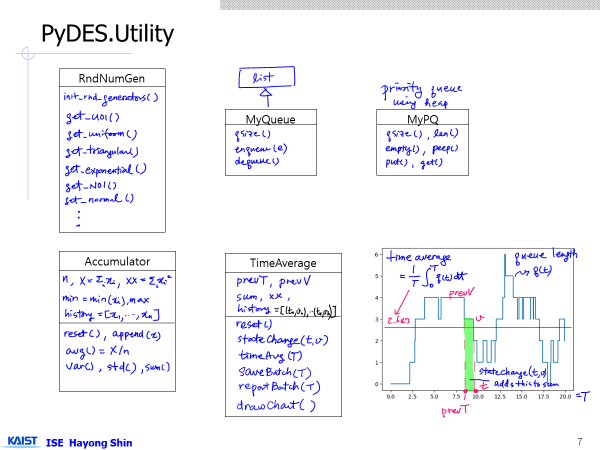
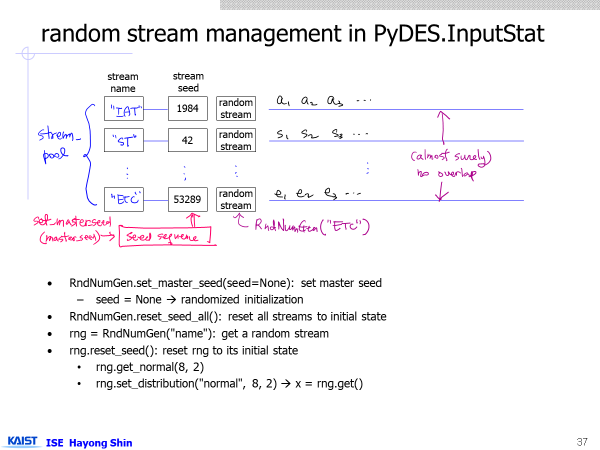
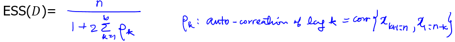
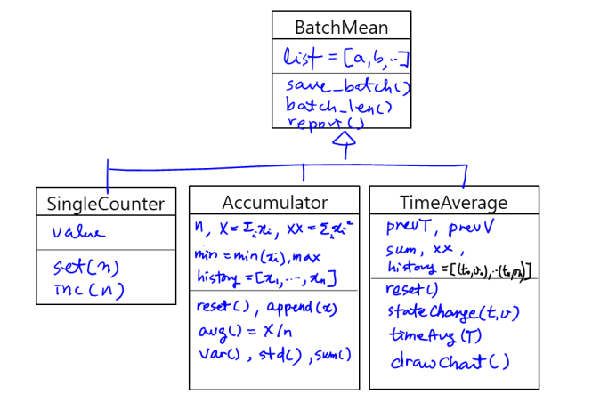

<h1 align="center">PyDES</h1>

<p align="center">
  <strong>Python Discrete Event Simulation Engine</strong>
</p>

<p align="center">
  <a href="LICENSE"></a>
  
</p>

<p align="center">
  <a href="#pydes-user-manual">Manual</a> &middot;
  <a href="#install">Install</a> &middot;
  <a href="#evtmsg-class">Documentation</a> &middot;
  <a href="#license">License</a>
</p>

PyDES is a discrete event simulation engine (or framework).





---

## Table of Contents

- [Install](#install)
- [Security](#security)
- [License](#license)
- [Documentation](#evtmsg-class)
    - [EvtMsg Class](#evtmsg-class)
    - [EvtMsgQueue Class](#evtmsgqueue-class)
    - [EModel Class](#emodel-class)
    - [Example: Single-Server Queue Using the Event Scheduling World View](#example-single-server-queue-using-the-event-scheduling-world-view)
    - [PModel Class](#pmodel-class)
    - [Example: Single-Server Queue Using the Process Interaction World View](#example-single-server-queue-using-the-process-interaction-world-view)
    - [PyDES.Utility and Random Stream Management](#pydesutility-and-random-stream-management)
    - [RndNumGen Class](#rndnumgen-class)
    - [AdvSampler Class](#advsampler-class)
    - [InputAnalyzer Class](#inputanalyzer-class)
    - [MyQueue Class](#myqueue-class)
    - [MyPQ Class](#mypq-class)
    - [Output Statistics Classes](#output-statistics-classes)

---

# PyDES User Manual

- Developed and maintained by
  - Hayong Shin
    - Professor
    - Department of Industrial & Systems Engineering
    - KAIST
  - Email: hyshin@kaist.ac.kr

- Version history
  - V0.3 (2026. 9. 1)

## Install

PyDES has no build step. Get the files, install the dependencies, and put the
PyDES folder on your Python import path.

### 1. Get the code

Clone the repository:

```bash
git clone https://github.com/System-Analytics-Lab-KAIST/PyDES.git
cd PyDES
```

Or download a snapshot without installing Git: on the
[repository page](https://github.com/System-Analytics-Lab-KAIST/PyDES), choose
**Code > Download ZIP** and unzip it wherever you like, for example `C:/PyDES`.

### 2. Install the dependencies

A virtual environment is recommended but not required.

```bash
python -m venv .venv

# Windows
.venv\Scripts\activate
# Linux / macOS
source .venv/bin/activate

python -m pip install --upgrade pip
python -m pip install -r requirements.txt
```

PyDES needs Python 3.10 or newer. All of the listed packages are required.

### 3. Make PyDES importable

There are many ways to inform the Python interpreter of additional folders to
import from. A simple method is to include the PyDES folder in a `.env` file in
your working folder:

```
PYTHONPATH=C:/PyDES
```

Or set it in the shell for the current session:

```bash
# Windows (PowerShell)
$env:PYTHONPATH = "C:/PyDES"
# Linux / macOS
export PYTHONPATH=/path/to/PyDES
```

### 4. Check that it worked

```bash
python -c "from DES import EvtMsgQueue; print(EvtMsgQueue('smoke').Tnow)"
```

This should print `0.0`.


# Security

Please do not report security issues in public issues. See [SECURITY.md](SECURITY.md) for the private reporting process.

# License

PyDES is released under the [MIT License](LICENSE). It may be freely used, modified, and distributed, including for commercial purposes, subject to the terms of the MIT License.

Copyright (c) 2026 PyDES Authors

---

# EvtMsg Class

## Overview

EvtMsg represents an event message exchanged between simulation models (ie. AModel instances) in PyDES. It is the basic communication unit used to trigger state changes either

- immediately (direct message), or
- at a future simulation time (scheduled event).

An EvtMsg contains the event time, sender, receiver, message type, and optional parameters.

## Constructor

```python
EvtMsg(time, fm, to, msg, param=None)
```

### Parameters

| Parameter | Description |
| --- | --- |
| `time` | Simulation time at which the event should occur. |
| `fm` | Sending model (source). |
| `to` | Receiving model (destination). |
| `msg` | Message (event) name. |
| `param` | Optional parameter or payload associated with the event. |

## Data Members

| Member | Description |
| --- | --- |
| `time` | Scheduled event time. |
| `fm` | Sender of the event. |
| `to` | Receiver of the event. |
| `msg` | Event type or message identifier. |
| `param` | Optional event data. |
| `canceled` | Indicates whether the event has been canceled. |
| `pause_time` | Stores the remaining delay when a scheduled event is paused (used by pause/resume mechanisms). |

## Event Scheduling

An event is typically created and inserted into the event calendar.

```python
evt = EvtMsg(
    time = 15.2,
    fm   = Machine1,
    to   = Machine2,
    msg  = "EM_Arrival",
    param = part
)
```

The simulation engine delivers the event to the destination model when the simulation clock reaches `time`.

## Immediate Message Passing

For zero-delay communication,

```python
EvtMsg(
    time = Tnow,
    fm   = sender,
    to   = receiver,
    msg  = "EM_StartService"
)
```

may be delivered immediately without entering the future event list, depending on the simulation engine implementation.

## Event Payload

`param` can contain any Python object.

Typical examples include

- Customer
- Part
- Job
- Resource
- Processing time
- Dictionary of event attributes

### Example

```python
EvtMsg(
    Tnow + service_time,
    server,
    customer,
    "ServiceCompleted",
    job
)
```

## Event Ordering

Events are ordered according to their scheduled time.

```python
def __lt__(self, other):
    return self.time < other.time
```

This allows EvtMsg objects to be stored directly in a priority queue (heapq) for efficient event scheduling.

## Copying an Event

```python
evt2 = evt.copy()
```

Creates a new event with the same contents.

The copied event is independent of the original and its `canceled` flag is reset to `False`.

## String Representation

```python
evt = EvtMsg(12.350, server, contoller, "EM_ServiceCompleted", job)
print(evt)
```

Example output: `EM_ServiceCompleted @ 12.350`

## Summary

EvtMsg provides a unified mechanism for communication among simulation models. By representing every interaction as an event message, PyDES supports both **future event scheduling** and **immediate model-to-model communication** using a common interface.

---

# EvtMsgQueue Class

## Overview

EvtMsgQueue is the Future Event List (FEL) of PyDES. It manages all scheduled events in chronological order and serves as the central event scheduler of the simulation engine.

The class extends MyPQ (priority queue) and stores EvtMsg objects ordered by their scheduled event times.

Unlike many DES frameworks where the scheduler only manages the Future Event List, EvtMsgQueue also handles **simulation clock management**, **real-time synchronization**, **monitor communication**, and **state persistence**. It therefore acts not only as an event queue but as the **simulation executive**, analogous to the executive component in classical DES architectures (event calendar + clock + dispatcher).

As the simulation executive of PyDES framework, EvtMsgQueue supports

- event scheduling,
- event cancellation, delay, pause/resume,
- run simulation,
- monitor communication,
- simulation state saving.

## Simulation Clock

The class maintains the global simulation clock.

| Variable | Description |
| --- | --- |
| `Tnow` | Current simulation time |
| `Tsince` | Synchronization reference time |
| `timeScale` | Simulation speed relative to real time |
| `timeUnitConversion` | Conversion between simulation time and wall-clock time |

Typical values of `timeScale`

| Value | Meaning |
| --- | --- |
| 0 | Run as fast as possible |
| 1 | Real-time simulation |
| 10 | Ten times faster than real time |

## Event Scheduling

### Schedule an Existing Event

```python
emq.scheduleEvtMsg(evt)
```

Schedules an EvtMsg object.

Returns the expected real-time delay when real-time execution is enabled.

### Schedule by Delay

```python
emq.scheduleEvtMsg4(delay, sender, receiver, message, parameter)
```

Creates an event scheduled at `Tnow + delay` and inserts it into the future event list.

## Next Event Time

```python
t = emq.peepTime()
```

Returns the scheduled time of the next event.

Returns infinity if the event list is empty.

## Event Search

Events may be searched using

- destination model
- message type
- parameter

```python
evt, index = emq.findEvtMsg(to=model, msg="Arrival")
```

## Event Cancellation

### Cancel One Event

```python
emq.cancelEvtMsg(to=model, msg="Departure")
```

The event is marked as canceled and ignored when processed.

### Cancel Multiple Events

```python
emq.cancelEvtMsgAll(to=model, msg="Arrival")
```

Cancels every matching event.

## Event Delay

### Delay One Event

```python
emq.delayEvtMsg(dt, to=model, msg="Timeout")
```

The event is canceled and rescheduled after an additional delay.

### Delay Multiple Events

```python
emq.delayEvtMsgAll(dt, to=model)
```

Delays every matching event.

## Pause and Resume

The queue supports temporary suspension of scheduled events.

### Pause

```python
emq.pauseEvtMsg(to=model, msg="RepairFinished")
```

The remaining delay is stored in the paused-event list.

### Resume

```python
emq.resumeEvtMsg(to=model, msg="RepairFinished")
```

The remaining delay is restored and the event is rescheduled.

Corresponding methods

- `pauseEvtMsgAll()`
- `resumeEvtMsgAll()`

operate on all matching events.

## Event Processing

### Execute One Event

```python
emq.runNextEvent()
```

The scheduler

1. Removes the earliest event.
2. Advances the simulation clock.
3. Delivers the event to the destination model.
4. Invokes

```python
receiver.processEvtMsg(event)
```

The destination model is responsible for handling the event.

### Execute the Simulation

```python
emq.runSimulation()
```

Runs until the future event list becomes empty.

The scheduler repeatedly executes

```text
Remove Earliest Event
        |
        v
Advance Simulation Clock
        |
        v
Deliver Event
        |
        v
Process Event
        |
        v
Schedule New Events
```

## Monitor Communication

EvtMsgQueue optionally communicates with an external simulation monitor through ZeroMQ.

Supported features include

- simulation clock display
- queue visualization
- widget updates
- simulation speed adjustment
- start/stop monitoring

Typical methods

```python
emq.makeZmq()

emq.sendMonMsg(message)

emq.checkMonMsg()
```

## Real-Time Simulation

When

```python
timeScale > 0
```

the scheduler synchronizes simulation time with wall-clock time.

For example

| timeScale | Execution |
| --- | --- |
| 0 | Maximum speed |
| 1 | Real time |
| 5 | Five times faster than real time |

Synchronization is handled automatically by

```python
sleep_a_moment()
```

## Queue Maintenance

Canceled events remain in the heap until explicitly removed.

```python
emq.clean()
```

removes canceled events and rebuilds the heap.

## Saving the Simulation

The complete simulation state may be saved using

```python
emq.saveState(file)
```

The monitor connection and log file are excluded from serialization.

## Typical Simulation Flow

```text
Model1
       |
       | scheduleEvtMsg4()
       v
EvtMsgQueue
       |
       | earliest event
       v
Advance Simulation Clock
       |
       v
Receiver.processEvtMsg()
       |
       v
Schedule Additional Events
```

## Main Methods

| Method | Description |
| --- | --- |
| `scheduleEvtMsg()` | Schedule an event |
| `scheduleEvtMsg4()` | Create and schedule an event after a delay |
| `findEvtMsg()` | Search for a scheduled event |
| `cancelEvtMsg()` | Cancel an event |
| `delayEvtMsg()` | Delay an event |
| `pauseEvtMsg()` | Pause an event |
| `resumeEvtMsg()` | Resume a paused event |
| `runNextEvent()` | Execute the earliest event |
| `runSimulation()` | Execute all scheduled events |
| `clean()` | Remove canceled events |
| `makeZmq()` | Connect to the simulation monitor |
| `saveState()` | Save the simulation state |

## Summary

EvtMsgQueue is the core scheduler of PyDES. It maintains the Future Event List, advances the simulation clock, dispatches events to simulation models, supports event management (cancel, delay, pause, and resume), synchronizes with real time when required, and interfaces with external monitoring tools. Every event-driven interaction in PyDES is coordinated through this class.

---

# EModel Class

## Overview

AModel is the base class for all event-driven simulation models in PyDES. It represents an active simulation unit that can send, receive, and process EvtMsg objects.

To build a simulation model using the **Event Scheduling World View**, users simply derive their models from EModel and implement the required event handlers.

Typical subclasses include

- Machine
- Server
- Source
- Sink
- AGV
- Controller
- Conveyor
- Robot

## Event-Driven Architecture

Models communicate exclusively through event messages (EvtMsg).

```text
Model 1   (EvtMsg)   Model 2
```

An event message may be

- scheduled through the EvtMsgQueue for future execution, or
- delivered immediately without scheduling.

Each model is responsible for processing the events addressed to it.

## Creating a Model

A new simulation model is created by inheriting from EModel.

```python
class Machine(EModel):

    def EM_arrival(self, e):
        ...

    def EM_departure(self, e):
        ...
```

Each event type is implemented as a member function whose name matches the event message.

## Event Processing

Incoming events are processed by

```python
processEvtMsg(event)
```

The method automatically dispatches the event to the corresponding handler.

For example,

```python
EvtMsg(..., msg="EM_arrival")
```

automatically invokes

```python
EM_arrival(event)
```

inside the receiving model.

No explicit event dispatcher or switch statement is required.

## Immediate Event Messaging

Sometimes an event should be processed immediately rather than being inserted into the Future Event List.

```python
self.directEvtMsg(receiver, "EM_start_service", param=customer)
```

This method

1. creates `evt = EvtMsg(None, self, receiver, "EM_start_service", param=customer)`
2. immediately invokes `receiver.processEvtMsg(evt)` without advancing the simulation clock.

`instantEvtMsg` is provided as an alias for `directEvtMsg`.

## Reusing an Existing Event

```python
self.directEvtMsg0(receiver, event)
```

sends an existing event object directly after updating its sender and receiver.

## Visualization Support

```python
makeSceneObj(mo_book)
```

may be overridden by derived classes to create graphical objects for the simulation monitor.

The default implementation does nothing.

## Default Event Handler

AModel provides one predefined event.

```python
EM_stop(event)
```

The default implementation cancels all future events, terminating the simulation.

Derived classes may override this behavior if necessary.

## Typical Execution Flow

```text
Sender -> schedule EvtMsg to EvtMsgQueue -> Receiver.processEvtMsg() -> Receiver.EM_xxx()

Sender -> Receiver.processEvtMsg() -> Receiver.EM_xxx()
```

## Example

```python
class Machine(EModel):
    def EM_arrival(self, e):
        customer = e.param
        print("Customer arrived")

    def EM_departure(self, e):
        print("Service completed")
```

The following code immediately invokes `Machine.EM_arrival()`.

```python
machine = Machine()
self.directEvtMsg(machine, "EM_arrival", customer)
```

## Summary

AModel is the fundamental building block for the Event Scheduling World View in PyDES. Every active simulation component is implemented as a subclass of EModel, and all interactions occur through EvtMsg objects. One notable design feature is that **event names are mapped directly to member function names** using `getattr()`. In PyDES, each model encapsulates its own state and behavior, and all interactions occur through message passing (EvtMsg). Compared with a centralized event dispatcher using switch or if-else, this approach makes adding new event types as simple as defining a new `EM_xxx()` method in the corresponding model. By mapping event messages directly to member functions, EModel provides a simple, modular, and extensible framework for constructing event-driven discrete-event simulation models.

---

# Example: Single-Server Queue Using the Event Scheduling World View

This example demonstrates how to implement an **M/M/1 single-server queue** using the **Event Scheduling World View** in PyDES.

The queueing system is implemented as a single class derived from EModel. The simulation logic is completely described by a small number of event handlers, while EvtMsgQueue automatically manages the Future Event List (FEL) and the simulation clock.

## System Description

The system consists of

- a Poisson arrival process (exponentially distributed interarrival times)
- one server with exponentially distributed service times
- an infinite FIFO queue,

The model maintains two state variables:

```python
self.q              # number of customers waiting
self.server_state   # 'idle' or 'busy'
```

The following performance measures are collected automatically.

```python
self.q_log = TimeAverage(...)  # average queue length
self.s_log = TimeAverage(...)  # server utilization
```

## Initialization

The constructor initializes the model, schedules the first customer arrival, and starts periodic batch statistics collection.

```python
class SSQ_Event(EModel):
    def __init__(self, emq, iat_mean, st_mean):

        super().__init__(emq)
        self.q = 0
        self.server_state = "idle"
        self.q_log = TimeAverage(0, 0, history=True)
        self.s_log = TimeAverage(0, 0, history=True)
        self.iat_mean = iat_mean
        self.st_mean = st_mean
        self.iat_gen = RndNumGen("IAT")
        self.st_gen = RndNumGen("ST")
        iat = self.iat_gen.get_exponential(self.iat_mean)
        self.emq.scheduleEvtMsg4(iat, self, self, "EM_c_arrival")
```

Notice that only the first arrival event is scheduled during initialization. Every subsequent arrival is scheduled by the arrival event itself.

## Event Handlers

The queueing system is completely described by five event handlers.

| Event | Description |
| --- | --- |
| `EM_c_arrival` | Customer arrival |
| `EM_s_start` | Start service |
| `EM_s_end` | End service |
| `EM_stop` | Stop simulation and report results |

### Customer Arrival

Whenever a customer arrives,

1. the queue length increases,
2. service begins immediately if the server is idle,
3. the next arrival is scheduled.

```python
def EM_c_arrival(self, e):
    self.update_q(+1)
    if self.server_state == "idle":
        self.directEvtMsg(self, "EM_s_start")
    self.schedule_customer_arrival()
```

Since arrivals follow a Poisson process, each arrival schedules the next one.

### Start of Service

When service begins,

1. the server becomes busy,
2. one customer leaves the waiting queue,
3. a service completion event is scheduled.

```python
def EM_s_start(self, e):
    self.set_server_state("busy")
    self.update_q(-1)
    st = self.st_gen.get_exponential(self.st_mean)
    self.emq.scheduleEvtMsg4(st, self, self, "EM_s_end")
```

The service completion time is determined by an exponentially distributed service time.

### End of Service

When service finishes,

1. the server becomes idle,
2. if customers are waiting, the next service starts immediately.

```python
def EM_s_end(self, e):
    self.set_server_state("idle")
    if self.q > 0:
        self.directEvtMsg(self, "EM_s_start")
```

Notice that `directEvtMsg()` is used instead of scheduling another event.

Since no simulation time should elapse between completing one service and starting the next, the event is delivered immediately without entering the Future Event List.

### Simulation Termination

A stop event is scheduled before the simulation starts.

When executed,

- all remaining events are cancelled,
- theoretical M/M/1 queueing values are computed,
- simulation statistics are reported,
- the queue-length history is displayed.

```python
def EM_stop(self, e):
    super().EM_stop(e)     # all remaining events are cancelled
    self.validation_MM1()  # compute and print theoretical M/M/1 values
    print (f"Simulation result {self.q_log}, {self.s_log}")
    self.q_log.plotHistory()


def validation_MM1(self):
    rho = self.st_mean / self.iat_mean
    qa = rho * rho / (1 - rho)
    print("M/M/1 (theoretical) ", f"average queue length = {qa:.3f}, "  f"server utilization = {rho:.3f}")
```

## Running the Simulation

The complete simulation requires only a few lines.

```python
def test_SSQ_Event(iat_mean=1.0, st_mean=0.9):
    RndNumGen.init_rnd_generators(42)
    emq = EvtMsgQueue("SSQ_Event")
    emq.timeScale = 0
    ssq = SSQ_Event(emq, iat_mean, st_mean)
    emq.scheduleEvtMsg4(201000.1, ssq, ssq, "EM_stop")
    emq.runSimulation()
```

`runSimulation()` repeatedly removes the earliest event from the Future Event List and dispatches it to the corresponding event handler.

## Event Flow



## Discussion

This example illustrates the essential programming pattern of the **Event Scheduling World View**.

- The system state changes only when an event occurs.
- Each event type is implemented as an `EM_xxx()` member function.
- Future activities are created by scheduling new events.
- Zero-delay activities are executed using `directEvtMsg()`.
- The simulation engine automatically advances the simulation clock and dispatches events to the appropriate handlers.

Although this example models a simple M/M/1 queue, the same programming pattern scales naturally to complex manufacturing, logistics, healthcare, and robotic systems involving multiple interacting resources and event-driven components.

---

# PModel Class

## Overview

PModel, which inherits EModel, is the base class for building simulation models using the **Process Interaction World View** in PyDES. Unlike EModel, where the model is driven by individual event handlers, a PModel describes its behavior as a **process (activity cycle)** using a Python generator (`yield`). The framework automatically suspends and resumes the process as events occur.

Typical applications include

- Customer
- Job
- Machine
- Worker
- AGV
- Robot
- Production process

A PModel is essentially a process-oriented model built on top of the event-scheduling engine (EvtMsgQueue), so it naturally supports hybrid view of event-scheduling and process-interaction.

## Process Interaction Model

A process model is implemented by defining the `process_cycle()` generator.

```python
class Customer(PModel):

    def process_cycle(self):
        print("Arrive")
        yield
        print("Start Service")
        yield
        print("Departure")
```

The process is automatically suspended at each `yield` and resumed later by the simulation engine.

## Constructor

```python
model = PModel(emq)
```

### Parameters

| Parameter | Description |
| --- | --- |
| `emq` | Event message queue (EvtMsgQueue) used by the simulation. |

Each newly created model is automatically registered so that its process can be initialized before the simulation begins.

## Process Initialization

Before simulation starts,

```python
PModel.init_process_all()
```

initializes every registered process.

Internally, this

1. creates the process generator,
2. stores it,
3. advances it to the first `yield`.

Normally the user does not need to call `init_process()` directly.

## Defining a Process

The default process is implemented in

```python
process_cycle()
```

Derived classes override this method.

```python
class Machine(PModel):

    def process_cycle(self):
        while True:

            ...
            yield
```

For convenience, `self.activity_cycle` is provided as an alias for `self.process_cycle`.

## Waiting for Time

A process can suspend itself for a specified duration.

```python
self.schedule_next(delay);  yield
```

(or equivalently, `yield self.schedule_next(delay)`)

`schedule_next(dt)` schedules an internal `"EM_next"` event after `dt` simulation time units.

When the event occurs, the process automatically resumes.

## Waiting for an Event

A process may explicitly specify which event it is waiting for.

```python
self.wait_event("EM_xxx");  yield
```

(or equivalently, `yield self.wait_event("EM_xxx")`)

When the corresponding event `"EM_xxx"` arrives,

```python
resume_process(...)
```

reactivates the suspended generator.

The framework checks that the received event matches the expected one.

## Resuming a Process

```python
resume_process(...)
```

continues execution from the previous `yield`.

Optionally, a value may be returned to the generator by calling `resume_process(ret_val=value)`

```python
value = yield
```

The returned value becomes the result of the `yield` expression.

## Internal Event

PModel defines one internal event

```python
EM_next
```

which is automatically generated by

```python
schedule_next()
```

Its purpose is to resume a suspended process after a specified delay.

Users normally do not override `EM_next()`.

## Accessing Simulation Time

Current simulation time is obtained by

```python
t = self.Tnow()
```

which simply returns `self.emq.Tnow`

## Typical Execution Flow

```text
Initialize Process
        |
        v
process_cycle()
        |
        v
yield schedule_next(dt)
        |
        v
Future Event List
        |
        v
EM_next
        |
        v
resume_process()
        |
        v
Continue after yield
```

## Example

```python
class Customer(PModel):

    def process_cycle(self):
        print("Arrived")
        yield self.schedule_next(5.0)
        print("Service Completed")
```

Execution

```text
t = 0.0   Arrived
t = 5.0   Service Completed
```

## Relationship to EModel

PyDES supports two modeling paradigms.

| Class | World View | Programming Style |
| --- | --- | --- |
| EModel | Event Scheduling | Event handlers (`EM_xxx`) |
| PModel | Process Interaction | `Process_cycle()` |

Internally, PModel is implemented on top of the event-scheduling mechanism. Every process suspension is translated into an `EM_next` event scheduled in the future event list.

It is important to note that PyDES provides hybrid world view (combining Event scheduling and Process interaction) as the modeling paradigm. Since Process-interaction view in PyDES is implemented on top of event-scheduling view by using python generator and internal event called `EM_next`, naturally it can combine the two. In other words, the main behavior of an active object (a PModel) can be described by its `process_cycle()` function. However, any exceptional behavior still can be defined by event handlers `EM_xxx()` just like a EModel object.

## Summary

PModel is the foundation of the **Process Interaction World View** in PyDES. Users describe the behavior of a simulation entity as a sequential process using Python generators, while PyDES automatically manages suspension, event scheduling, and process resumption through the underlying event-driven simulation engine. This allows complex process logic to be written in a natural, sequential programming style while retaining the efficiency of an event-scheduling simulator.

---

# Example: Single-Server Queue Using the Process Interaction World View

This example demonstrates how to implement an **M/M/1 single-server queue** using the **Process Interaction World View** in PyDES.

The model is divided into two process-oriented components:

- `CustomerGenerator`: generates customer arrivals
- `SSQ_Process`: represents the queue and server process

Both classes inherit from PModel. Their behavior is written as sequential process logic using Python generators and `yield`.

## System Description

The system consists of

- a Poisson arrival process (exponentially distributed interarrival times)
- one server with exponentially distributed service times
- an infinite FIFO queue,

The queueing model maintains the following state variables:

```python
self.q              # number of customers waiting
self.server_state  # "idle" or "busy"
```

Time-average statistics are collected for

```python
self.q_log = TimeAverage(...)  # average queue length
self.s_log = TimeAverage(...)  # server utilization
```

## Model Structure

The model separates the arrival process from the service process.

```text
CustomerGenerator
        |
        | EM_c_arrival
        v
SSQ_Process
        |
        +- Waiting queue
        +- Single server
```

`CustomerGenerator` repeatedly waits for the next interarrival time and then sends an arrival message to `SSQ_Process`. `SSQ_Process` waits for customers, performs service, and repeats the service cycle.

## CustomerGenerator

`CustomerGenerator` is responsible for generating the arrival stream.

```python
class CustomerGenerator(PModel):

    def __init__(self, emq, to_model, iat_mean=1.0):
        super().__init__(emq)
        self.iat_mean = iat_mean
        self.iat_gen = RndNumGen("IAT")
        self.to_model = to_model
        self.init_process()
```

The constructor stores

- the mean interarrival time,
- the destination model,
- the random-number generator used for interarrival times.

`init_process()` creates and starts the generator returned by `process_cycle()`.

## Customer-Generation Process

```python
def process_cycle(self):

    while True:
        iat = self.iat_gen.get_exponential(self.iat_mean)
        yield self.schedule_resume(iat)
        self.directEvtMsg(self.to_model, "EM_c_arrival")
```

The process operates as follows:

1. Suspend for the interarrival time ~ Exponential dist.
2. Resume when the internal `EM_next` event occurs.
3. Send an immediate `EM_c_arrival` message to the queueing model.
4. Repeat 1~3 indefinitely.

Although the code appears sequential, `schedule_resume()` internally schedules an event in the Future Event List and `yield` suspends the generator until that event occurs.

## SSQ_Process

`SSQ_Process` represents both the waiting queue and the single server.

```python
class SSQ_Process(PModel):
    def __init__(self, emq, iat_mean, st_mean):
        super().__init__(emq)
        self.iat_mean = iat_mean
        self.st_mean = st_mean
        self.cust_gen = CustomerGenerator(emq, self, self.iat_mean)
        self.st_gen = RndNumGen("ST")
        self.q = 0
        self.q_log = TimeAverage(0, 0, history=True)
        self.server_state = "idle"
        self.s_log = TimeAverage(0, 0, history=True)
        self.init_process()
```

The constructor

1. creates the customer generator,
2. initializes the queue and server states,
3. creates the service-time generator,
4. initializes performance statistics,
5. schedules the first batch-statistics event,
6. starts the server process.

## State-Update Methods

### Server State

```python
def set_server_state(self, s):
    self.server_state = s
    self.s_log.stateChange(self.Tnow(), s == "busy")
```

The server state is recorded as

- 1 when busy,
- 0 when idle.

Therefore, the time average of this variable is the server utilization.

### Queue Length

```python
def update_q(self, inc):
    self.q += inc
    self.q_log.stateChange(self.Tnow(), self.q)
```

The queue length is increased or decreased whenever a customer arrives or starts service.

The TimeAverage object integrates the queue length over time.

## Server Process Cycle

The main service logic is written as a single sequential process.

```python
def process_cycle(self):
    while True:
        if self.q == 0:
            yield self.wait_event("EM_c_arrival")
        self.set_server_state("busy")
        self.update_q(-1)
        st = self.st_gen.get_exponential(self.st_mean)
        yield self.schedule_next(st)
        self.set_server_state("idle")
```

This process describes the server's complete activity cycle.

The code closely follows the natural description of server behavior.

### Waiting for an Arrival

```python
if self.q == 0:
    yield self.wait_event("EM_c_arrival")
```

If no customer is waiting, the server process declares that it is waiting for an `EM_c_arrival` event and suspends at `yield`. The process remains suspended until the arrival event handler explicitly resumes it.

### Starting Service

```python
self.set_server_state("busy")
self.update_q(-1)
```

Once a customer is available,

- the server becomes busy,
- one customer is removed from the waiting queue.

The model does not explicitly store individual customer objects because only aggregate queue-length statistics are required.

### Performing Service

```python
st = self.st_gen.get_exponential(self.st_mean)
yield self.schedule_resume(st)
```

A service time is generated, and the server process is suspended for that duration.

Internally, `schedule_resume(st)` creates an `EM_resume` event scheduled at `Tnow + st`

When the event occurs, `PModel.EM_resume()` resumes the process immediately after the `yield`.

### Completing Service

```python
self.set_server_state("idle")
```

After the service delay expires, the server becomes idle.

The `while True` loop then checks the queue again. If another customer is waiting, the next service starts without advancing simulation time.

## Customer Arrival Event Handler

Even in a process-interaction model, external events may be handled using event handlers.

```python
def EM_c_arrival(self, e):
    self.update_q(+1)
    if self.server_state == "idle":
        self.resume_process(check_evt=e.msg)
```

When a customer arrives,

1. the queue length increases,
2. if the server is idle, the suspended server process is resumed.

`check_evt=e.msg` verifies that the server process was actually waiting for `EM_c_arrival`.

If the server is already busy, the customer simply remains in the queue. The server process will take that customer after completing its current service.

## Simulation-Termination Event Handler

: same as in Event view example

## Running the Simulation

```python
def test_SSQ_Process(iat_mean=1.0, st_mean=0.9):
    RndNumGen.init_rnd_generators(42)
    emq = EvtMsgQueue("SSQ_Process")
    emq.timeScale = 0
    ssq = SSQ_Process(emq, iat_mean, st_mean)
    emq.scheduleEvtMsg4(201000.1, ssq, ssq, "EM_stop")
    emq.runSimulation()
```

The execution steps are

1. initialize the random-number generators,
2. create the Future Event List,
3. create the queueing model,
4. schedule the stop event,
5. run the simulation.

Setting `emq.timeScale = 0` runs the model as fast as possible without synchronizing with wall-clock time.

## Complete Process Flow



## Process Interaction and Event Scheduling

This example uses the Process Interaction World View, but it still operates on top of the event-scheduling engine.

| Process-level statement | Internal event-level action |
| --- | --- |
| `yield schedule_next(dt)` | Schedule an `EM_next` event |
| `yield wait_event(msg)` | Suspend the process until `msg` arrives |
| `resume_process()` | Resume the suspended generator |
| `directEvtMsg()` | Immediately deliver an event message |

Thus, the process-oriented code provides a sequential and intuitive description, while EvtMsgQueue still performs the underlying event scheduling.

## Comparison with the Event-Scheduling Version

In the event-scheduling implementation, service behavior is divided among separate handlers:

```python
EM_c_arrival
EM_s_start
EM_s_end
```

In the process-interaction implementation, the same behavior is written as one sequential process cycle:

```python
while True:
    if self.q == 0:
        yield self.wait_event("EM_c_arrival")
    self.set_server_state("busy")
    self.update_q(-1)
    st = self.st_gen.get_exponential(self.st_mean)
    yield self.schedule_resume(st)
    self.set_server_state("idle")
```

The process-interaction version is often easier to read because the service sequence appears in its natural chronological order.

## Summary

This example illustrates how PModel can be used to construct a single-server queue using the Process Interaction World View.

- `CustomerGenerator` represents the recurring arrival process.
- `SSQ_Process` represents the server activity cycle.
- `yield` suspends a process.
- `schedule_resume()` resumes it after a specified delay.
- `wait_event()` suspends it until an external event occurs.
- `resume_process()` reactivates a process waiting for that event.
- Ordinary event handlers can still be combined with process-oriented logic.

The example also shows that PyDES supports a hybrid implementation style: the main server behavior is expressed as a process, while arrivals, batch collection, and simulation termination are handled as event messages.

---

# PyDES.Utility and Random Stream Management





---

# RndNumGen Class

## Overview

RndNumGen is a random number generation utility that manages **multiple independent random streams** for simulation. Each stream is identified by a unique name and is reproducible through a master seed.

The class is designed for discrete-event simulation where different stochastic components (e.g., arrivals, service times, machine failures) should use independent random number streams.

## Initialization

Before using any random streams, initialize the stream manager.

```python
RndNumGen.init_rnd_generators(master_seed=12345)
```

- Creates a pool of independent random streams.
- All streams are reproducible from the specified `master_seed`.
- A default stream named `"default"` is automatically created.

## Creating a Random Stream

```python
rng = RndNumGen("arrival")
```

If the stream `"arrival"` does not exist, it is automatically created.

Subsequent calls using the same stream name share the same random stream.

```python
arrival_rng = RndNumGen("arrival")
service_rng = RndNumGen("service")
failure_rng = RndNumGen("failure")
```

In this example, `rng` and `arrival_rng` share the same stream, where as `service_rng` and `failure_rng` use separate streams.

## Supported Distributions

The class supports the following distributions.

| Method | Distribution |
| --- | --- |
| `get_U01()` | Uniform(0,1) |
| `get_N01()` | Standard Normal |
| `get_uniform(low, high)` | Uniform |
| `get_unif_int(low, high)` | Uniform Integer |
| `get_exponential(mean)` | Exponential |
| `get_triangular(low, mode, high)` | Triangular |
| `get_normal(mu, sigma)` | Normal |
| `get_gamma(k, theta)` | Gamma |
| `get_beta(alpha, beta)` | Beta |
| `get_beta4(alpha, beta, low, high)` | Scaled Beta |
| `get_choice(choices, probs)` | Discrete Choice |
| `get_exp_gamma(...)` | Exponential/Gamma Mixture |

## Preconfigured Distributions

A distribution can be configured once and sampled repeatedly without supplying parameters each time.

```python
rng = RndNumGen("service")
rng.set_distribution("exponential", 5.0)

x = rng.get()
```

Equivalent to repeatedly calling

```python
x = rng.get_exponential(5.0)
```

Supported distribution names include

- `"uniform"`
- `"exponential"`
- `"triangular"`
- `"normal"`
- `"gamma"`
- `"beta"`
- `"beta4"`
- `"choice"`
- `"exp_gamma"`

## Choice Distribution

```python
rng.set_distribution("choice",  ["A","B","C"], [0.2,0.3,0.5])
index, value = rng.get()
```

## Stream Management

### Reset one stream

```python
RndNumGen.reset_seed("arrival")
```

Resets the specified stream to its initial state.

### Reset all streams

```python
RndNumGen.reset_seed_all()
```

Resets every random stream to its original seed.

This is useful when repeating a simulation experiment under exactly the same random numbers.

## Typical Usage

```python
RndNumGen.init_rnd_generators(1234)

arrival = RndNumGen("arrival")
service = RndNumGen("service")
iat = arrival.get_exponential(5)
st = service.get_normal(8,2)
```

## Recommended Stream Assignment

For variance reduction and reproducibility, assign one stream to each stochastic component.

```text
Arrival Process      -> "arrival"
Service Time         -> "service"
Machine Failure      -> "failure"
Repair Time          -> "repair"
Customer Routing     -> "routing"
```

This stream separation enables techniques such as **Common Random Numbers (CRN)** while preventing unintended correlations among different random variables.

## Notes

- Each stream is created only once and reused thereafter.
- Stream creation is automatic when a new stream name is requested.
- All streams are reproducible from the master seed.
- `set_distribution()` stores distribution parameters and binds `rng.get()` to the corresponding sampling function, providing a simple interface for repeated sampling.
- The implementation is based on NumPy's Generator, allowing access to high-quality pseudo-random number generation while managing multiple independent streams transparently.

## Short-cut for distribution generator

```python
make_dist_generator(stream_name, dist_name, *param)
```

Creates a random stream and set it for generating a specific distribution.

**Parameter**

- `stream_name` : name for random stream
- `dist_name` : distribution name, such as `"normal"`, `"uniform"`, and so on
- `*param` : list of parameters for the specified distribution

**Returns**

- `rng` : an instance of RndNumGen

**Interpretation**

```python
gen = make_dist_generator(stream_name, dist_name, param)
```

is identical to:

```python
gen = RndNumGen(stream_name)
gen.set_distribution(dist_name, param)
```

**Example**

```python
iat_gen = make_dist_generator("arrival", "exponential", 1.0)
```

---

# AdvSampler Class

## Overview

AdvSampler provides advanced random sampling methods for Monte Carlo simulation and Bayesian computation. It supports **rejection sampling**, **importance sampling**, **Metropolis-Hastings MCMC**, and **PyMC-based MCMC**, together with methods for estimating the effective sample size (ESS).

The target and proposal distributions are assumed to follow the interface of probability distributions in `scipy.stats`.

## 1. Constructor

```python
AdvSampler(p, q, rng=None)
```

Creates an advanced sampler with target distribution `p` and proposal distribution `q`.

**Parameters**

- `p` : Target distribution. It must provide `p.logpdf(x)`
- `q` : Proposal distribution. It must provide `q.rvs(...)`, `q.logpdf(x)`
- `rng` : Random number generator used for sampling.

## 2. Rejection Sampling

```python
prep_rejection_sampling(log_M)
```

Prepares the sampler for rejection sampling by specifying the envelope constant (M).

Rejection sampling requires  `p(x) < Mq(x)`

For numerical stability, the logarithm of (M) is supplied instead of (M) itself.

**Parameter**

- `log_M` : Logarithm of the envelope constant log M.

```python
rejection_sampling(n_samples)
```

Generates samples from the target distribution using rejection sampling.

**Parameter**

- `n_samples` : Number of accepted samples to generate.

**Returns**

- `samples` : Accepted samples.
- `n_trial` : Total number of proposal samples generated.

**Example**

```python
from scipy.stats import norm
import numpy as np

rng = np.random.default_rng(1234)
p = norm(loc=0, scale=1)
q = norm(loc=0, scale=2)
sampler = AdvSampler(p, q, rng)
log_M = np.log(2)
sampler.prep_rejection_sampling(log_M)
samples, n_trial = sampler.rejection_sampling(10000)
print (f"mean = {samples.mean()}")
print (f"acceptance rate = {len(samples) / n_trial}")
```

## 3. Importance Sampling

```python
importance_sampling(n_samples)
```

Generates samples from the proposal distribution and computes their importance weights.

Samples are generated as $\{(x_i, w_i);\ 0 \le i < n\_samples\}$

**Parameter**

- `n_samples` : Number of proposal samples.

**Returns**

- `x` : Samples generated from the proposal distribution.
- `w` : Normalized importance weights (the average of `w` is 1)

`ESS_IS(w)`: Computes the **relative effective sample size** of importance sampling weights.

The conventional importance sampling ESS is

$$\mathrm{ESS}(w) = \frac{\left(\sum_{i=1}^{n} w_i\right)^2}{\sum_{i=1}^{n} w_i^2}$$

**Parameter**

- `w` : Importance sampling weights.

**Returns**

- `ess_ratio` : Effective sample size divided by the number of samples $(\mathrm{ESS}(w)/n)$.

**Interpretation**

A value close to 1 indicates nearly uniform weights and an efficient proposal distribution. A value close to 0 indicates that the estimate is dominated by a small number of samples.

**Example**

```python
from scipy.stats import norm
import numpy as np

rng = np.random.default_rng(1234)
p = norm(loc=0, scale=1)
q = norm(loc=0, scale=2)
sampler = AdvSampler(p, q, rng)
x, w = sampler.importance_sampling(10000)
print (f"mean = {(x * w.reshape(-1,1)).mean()}") # weighted average
print (f"ESS = {sampler.ESS_IS(w)}")
```

## 4. MCMC

```python
prep_MCMC(x0, burn_in, RW=True, step_size=1.0)
```

Initializes the Markov chain and performs burn-in iterations.

Two proposal schemes are supported:

- `RW=True`: Symmetric Random-Walk Metropolis
- `RW=False`: Independent Metropolis-Hastings

**Parameters**

- `x0` : Initial state of the Markov chain.
- `burn_in` : Number of burn-in iterations.
- `RW` : Selects the proposal scheme.
- `step_size` : Scaling factor for the random-walk proposal (ignored when `RW=False`)

`MCMC(n_sample)`: Generates samples using the MCMC scheme selected by `prep_MCMC()`.

```python
samples, n_accept = sampler.MCMC(n_sample)
```

**Parameter**

- `n_sample` : Number of MCMC iterations.

**Returns**

For `n_sample > 1`:

- `samples` : ndarray, shape (n_sample, dim)
  Generated Markov chain states.
- `n_accept` : int
  Number of accepted proposals.

For `n_sample == 1`, only 1 sample (the current state) is returned.

**Example**

```python
samples, n_accept = sampler.MCMC(10000)

accept_rate = n_accept / len(samples)

print("Acceptance rate =", accept_rate)
```

Progress is printed every 1,000 iterations.

`ESS_MCMC(x)`: Estimates the effective sample size of an MCMC sequence separately for each component.

For a scalar Markov chain, the effective sample size is given as:



**Parameter**

- `x` : MCMC samples.

**Returns**

- `ess` : Estimated ESS for each component. (ndarray of shape (dim,))

**Example**

```python
x0 = np.zeros(dim)
sampler.prep_MCMC(x0=x0, burn_in=5000, RW=True, step_size=0.5)
samples, n_accept = sampler.MCMC(10000)
print (f"mean = {samples.mean()}")
print (f"acceptance rate = {len(samples) / 10000}")
ess = sampler.ESS_MCMC(samples)
print("Mean ESS =", ess.mean())
print("Min  ESS =", ess.min())
```

## Notes

1. `p` and `q` are expected to follow the `scipy.stats` distribution interface.
2. Rejection sampling requires a valid envelope constant satisfying p(x) < Mq(x) over the entire support of the target distribution.
3. For random-walk MCMC, `q` represents the distribution of the proposal **increment**, not the distribution of the proposed state itself.
4. `ESS_IS()` returns the **relative ESS**, (ESS/N), whereas `ESS_MCMC()` returns the actual ESS for each component.
5. `ESS_MCMC()` is a simple autocorrelation-based estimator. Its results may differ from the rank-normalized bulk and tail ESS estimates reported by packages such as ArviZ.

---

# InputAnalyzer Class

## Overview

InputAnalyzer is a base class for input distribution modeling and analysis in PyDES. It provides common functions for random sampling, probability distribution evaluation, parameter estimation, visualization, and goodness-of-fit testing. Distribution-specific subclasses can override methods such as `set_params()`, `get_sample()`, `get_pdf()`, `get_cdf()`, `get_mean()`, `get_std()`, and `n_params()`

## Constructor

```python
InputAnalyzer(rng=None)
```

## Methods

```python
get_quantile(p)
```

Returns the quantile $x_p$ satisfying $F(x_p) = p$  i.e. $x_p = F^{-1}(p)$

```python
fit_EM(X, max_iter=100, tol=1e-6)
```

Interface for fitting a distribution using the Expectation-Maximization (EM) algorithm.

The base implementation only stores `X`. Actual EM fitting must be implemented by subclasses, particularly mixture-distribution analyzers.

## Visualization

```python
plot_histo(X=None, bins=30, ax=None)
```

Plots a normalized histogram of the observed data.

**Parameters**

- `X` - Input data. If omitted, `self.data` is used.
- `bins` - Number of histogram bins. Default: 30.
- `ax` - Existing Matplotlib axis. If omitted, a new figure is created.

```python
plot_pdf(ax=None, color='blue', label='PDF')
```

Plots the current PDF..

```python
plot_QQ(X=None)
```

Creates a Q-Q plot comparing observed sample quantiles with theoretical quantiles of the distribution.

**Parameters**

- `X` - Input data. If omitted, `self.data` is used.

## Goodness-of-Fit Tests

```python
chi_squared_test(X, bins=20)
```

Performs a Pearson chi-square goodness-of-fit test. Unlike ordinary equal-width histogram binning, the method constructs **equal-probability bins** from the fitted distribution.

**Parameters**

- `X` - Input data. If omitted, `self.data` is used.
- `bins` - Number of histogram bins. Default: 30.

**Interpretation**

- p-value >= 0.05: cannot reject the fitted distribution (fitting is good)
- p-value < 0.05: reject the fitted distribution (fitting is bad)

```python
ks_test(X)
```

Performs a Kolmogorov-Smirnov goodness-of-fit test comparing the empirical CDF FN(x) with the theoretical/fitted CDF F(x).

**Parameters**

- `X` - Input data. If omitted, `self.data` is used.

---

# MyQueue Class

## Overview

MyQueue is a queue class for discrete-event simulation. It extends Python's built-in `list` and supports customizable queue disciplines, automatic queue statistics, and optional monitoring for animation or visualization.

The default discipline is FIFO, but any queue selection rule can be supplied.

## Constructor

```python
q = MyQueue(name, selector=None, emq=None, log=None, widget=None)
```

**Parameters**

| Parameter | Description |
| --- | --- |
| `name` | Queue name used for statistics and monitoring. |
| `selector` | Function that selects which customer/entity to remove. Default is FIFO. |
| `emq` | Simulation engine used for monitoring messages. |
| `log` | TimeAverage instance to record queue length change over time |
| `widget` | Optional widget name for real-time visualization. |

## Queue Operations

### enqueue(entity)

Adds an entity to the queue.

```python
q.enqueue(customer)
```

The queue size is automatically updated for monitoring and statistics.

### dequeue()

Removes and returns the next entity according to the queue discipline.

```python
customer = q.dequeue()
```

**Returns**

- the selected entity
- `None` if the queue is empty.

### qsize()

Returns the current number of entities.

Note that `q.qsize()` is equivalent to `len(q)`.

## Queue Disciplines

A queue discipline is specified by the `selector` function.

The selector receives the queue itself and returns the index of the entity to remove.

**FIFO (default)**: Removes the oldest entity.

```python
q = MyQueue("Waiting")
```

or

```python
q = MyQueue("Waiting", selector=MyQueue.fifo_selector)
```

**LIFO**: Removes the most recently added entity.

```python
q = MyQueue("Stack", selector=MyQueue.lifo_selector)
```

### Custom Queue Discipline

Users may define any selection rule.

Example: shortest processing time.

```python
def spt_selector(queue):
    return min(
        range(len(queue)),
        key=lambda i: queue[i].proc_time
    )

q = MyQueue("SPT", selector=spt_selector)
```

This makes MyQueue suitable for implementing arbitrary scheduling policies.

## Queue Statistics

If `log > 0`, the queue automatically maintains the time-average queue length.

```python
q = MyQueue("Buffer", log=1)
```

The statistics are updated automatically whenever the queue size changes.

**Methods**

```python
q.reset_stat(t)
```

Resets statistics at simulation time `t`.

```python
series = q.get_stat_series(T)
```

Returns a statistical time series for plotting or analysis.

## Monitoring

When connected to a simulation engine (`emq`), every enqueue/dequeue operation automatically generates monitoring messages.

Typical monitored information includes

- Current queue length
- Time-average queue length
- Widget updates for animation or dashboards

No additional user code is required.

## Example

```python
q = MyQueue("WaitingQueue", log=1)

q.enqueue(c1)
q.enqueue(c2)

print(q.qsize())      # 2

customer = q.dequeue()

print(q.qsize())      # 1
```

## Features

- FIFO queue by default
- Supports LIFO and arbitrary queue disciplines
- Automatic queue-length statistics
- Time-average queue-length calculation
- Built-in monitoring interface
- Compatible with visualization widgets
- Simple API based on Python's built-in list

---

# MyPQ Class

## Overview

MyPQ is a lightweight priority queue class implemented as a wrapper around Python's built-in `heapq` module. It maintains elements in ascending priority order (min-heap), so the smallest element is always removed first.

The stored objects must be comparable (i.e., implement the comparison operators such as `__lt__`).

## Constructor

`MyPQ()`: Creates an empty priority queue.

```python
pq = MyPQ()
```

## Methods

`put(obj)`: Inserts an object into the priority queue.

```python
pq.put(obj)
```

The object is inserted while maintaining the heap property.

Time Complexity: O(log n)

`get()`: Removes and returns the smallest object.

```python
obj = pq.get()
```

Raises `IndexError` if the queue is empty.

Time Complexity: O(log n)

`peep()`: Returns the smallest object without removing it.

```python
obj = pq.peep()
```

Returns `None` if the queue is empty.

Time Complexity: O(1)

### empty()

Checks whether the queue is empty.

```python
if pq.empty():
    ...
```

**Returns**

- `True` if the queue is empty.
- `False` otherwise.

### qsize()

Returns the number of elements in the queue.

`pq.qsize()` is equivalent to `len(pq)` or `pq.len()`.

### len()

Returns the number of stored elements.

`pq.len()` is equivalent to `qsize()`.

### `__len__()`

Allows the built-in `len()` function.

```python
n = len(pq)
```

`clear()`: Removes all elements from the queue.

```python
pq.clear()
```

`heapify()`: Converts the current internal list into a valid heap.

```python
pq.heapify()
```

This method is useful after directly modifying `pq.heap`.

Time Complexity: O(n)

## Example

```python
pq = MyPQ()

pq.put(10)
pq.put(2)
pq.put(7)

print(pq.peep())      # 2
print(len(pq))        # 3

while not pq.empty():
    print(pq.get())
```

Output

```text
2
3
2
7
10
```

## Notes

- MyPQ implements a min-heap.
- Objects inserted into the queue must be mutually comparable.
- `get()` raises an exception when called on an empty queue.
- `peep()` safely returns `None` if the queue is empty.

---

# Output Statistics Classes

## Overview

PyDES provides the following statistical utility classes for simulation output analysis.

- **BatchMean** stores batch observations and estimates their mean and standard error.
- **Accumulator** collects observation-based statistics such as mean, standard deviation, minimum, and maximum. It inherits BatchMean, so that
- **TimeAverage** collects time-weighted statistics for state variables that remain constant between state changes.
- **SingleCounter** maintains a counter (and its batch statistics).
- **MultiCounter** maintains multiple counters and their batch statistics.

PyDES also provides the following classes for organizing simulation statistics and exporting them as tables:

- **StateTime**: measures the amount of simulation time spent in each state
- **TableStat**: manages groups of statistical entities and exports their results to Excel
- **JobLogTable**: records the state time of individual jobs in a tabular format

Together they support most performance measures encountered in discrete-event simulation.

## 1. BatchMean

### Overview

BatchMean stores one observation from each simulation batch and calculates the mean and standard error across batches. It is derived directly from Python's `list` (`class BatchMean(list)`). Therefore, ordinary list operations such as `append()`, indexing, and `len()` can be used. A typical use is:

```python
bm = BatchMean()

bm.append(10.2)
bm.append(11.3)
bm.append(9.8)
bm.append(10.7)

print(bm)
```

Each element normally represents a statistic obtained from one simulation batch.

BatchMean class keeps track of all instances of itself in `BatchMean.bm_list`, so that `BatchMean.save_batch_all(t)` function calls `bm.save_batch(t)` for every `bm` in `bm_list`. Note that `BatchMean.save_batch_all(t)` function is automatically called by the default `EM_batch(e)` handler of EModel class for convenience.

### report(s=0)

```python
avg, serr, n = bm.report(s=0)
```

Calculates the sample mean and its standard error using the stored batch observations.

**Parameter**

- `s` : int, default=0, the number of observations to skip from the beginning.
  The observations used are `self[s:]`
  This is useful when the first batch is treated as a warm-up batch.

**Returns**

- `avg` : float, Mean of the selected batch observations.
- `serr` : float, Estimated standard error of the mean.
- `n` : int, Number of batch observations used.

**Example**

```python
bm = BatchMean()

bm.append(10.0)
bm.append(11.0)
bm.append(9.5)
bm.append(10.5)

avg, serr, n = bm.report()

print(avg, serr, n)
```

To discard the first batch:

```python
avg, serr, n = bm.report(s=1)
```

### String Representation

```python
print(bm)
```

returns a string of the form

```text
10.267 (+/- 0.360), n=3
```

The first stored batch is automatically excluded by `__str__()`:

```python
self.report(s=1)
```

Thus, the default printed result treats the first batch as a warm-up batch.



## 2. Accumulator

### Purpose

Accumulator collects a sequence of observations and computes descriptive statistics.

Typical applications include

- Service time
- Waiting time
- Cycle time
- Throughput per job
- Interarrival time

### Constructor

```python
acc = Accumulator(history=False)
```

**Parameters**

| Parameter | Description |
| --- | --- |
| `history` | If `True`, stores every observation for later plotting or analysis. |

### Adding Observations

```python
acc.append(x)
```

Adds one observation.

### Statistics

| Method | Description |
| --- | --- |
| `avg()` | Sample mean |
| `var()` | Sample variance |
| `std()` | Sample standard deviation |
| `sum()` | Sum of observations |

Additional statistics maintained automatically:

- Number of observations (n)
- Minimum
- Maximum

### Reset

```python
acc.reset()
```

Clears all accumulated statistics.

### Batch Statistics

The class supports the batch-means method.

**Save current batch**

```python
acc.save_batch()
```

Stores the current batch mean and resets the accumulator.

**Report batch statistics**

```python
avg, serr, n = acc.reportBatch()
```

**Returns**

- Mean of batch means
- Standard error
- Number of batches

### Statistical Summary

```python
series = acc.get_stat_series()
```

**Returns**

| Statistic |
| --- |
| Sample size |
| Mean |
| Standard deviation |
| Minimum |
| Maximum |

### Example

```python
acc = Accumulator()

for x in samples:
    acc.append(x)

print(acc.avg())
print(acc.std())
```

## 3. TimeAverage

### Purpose

TimeAverage computes **time-weighted statistics** of a state variable.

Unlike Accumulator, which averages observations, TimeAverage averages

$$\frac{1}{T}\int_{0}^{T} f(t)\,dt$$

Typical applications include

- Queue length
- Number in system
- Server utilization
- Inventory level
- Number of busy machines

### Constructor

```python
ta = TimeAverage(t0=0, v0=0, history=False)
```

**Parameters**

| Parameter | Description |
| --- | --- |
| `t0` | Initial simulation time |
| `v0` | Initial state value |
| `history` | Stores the complete state trajectory for plotting |

### Updating the State

Whenever the state changes, `ta.stateChange(time, new_value)` must be called.

**Example**

Queue Length  t=3.2 : 2 -> 3

```python
ta.stateChange(3.2, 3)
```

### Incrementing the State

```python
ta.stateInc(time, dv)
```

Adds `dv` to the current state.

**Example**

```python
ta.stateInc(t,+1)   # arrival
ta.stateInc(t,-1)   # departure
```

### Computing Statistics

**Time-average**

```python
avg = ta.timeAvg(current_time)
```

Returns $\frac{1}{T}\int_{0}^{T} f(t)\,dt$

**Mean and Standard Deviation**

```python
avg, std = ta.timeAvg(current_time, std=True)
```

**Returns**

- Time-average
- Time-weighted standard deviation

### Summary

```python
series = ta.get_stat_series(current_time)
```

**Returns**

| Statistic |
| --- |
| Time-average |
| Minimum |
| Maximum |

### Reset

```python
ta.reset(current_time)
```

Starts a new observation period.

### Batch Means

**Save current batch**

```python
ta.save_batch(current_time)
```

Stores the batch time-average and starts a new batch.

**Report batch statistics**

```python
avg, serr, n = ta.reportBatch()
```

**Returns**

- Mean of batch averages
- Standard error
- Number of batches

### History

If `history=True`, the complete state trajectory is stored.

The trajectory can be plotted using

```python
ta.plotHistory()
```

which produces a step function representing the state over time.

### Example

```python
ta = TimeAverage(0,0)

ta.stateInc(1.2,+1)
ta.stateInc(2.5,+1)
ta.stateInc(5.0,-1)

avg = ta.timeAvg(10.0)
```

### Choosing the Correct Class

| Performance Measure | Class |
| --- | --- |
| Waiting time | Accumulator |
| Service time | Accumulator |
| Interarrival time | Accumulator |
| Cycle time | Accumulator |
| Queue length | TimeAverage |
| Number in system | TimeAverage |
| Server utilization | TimeAverage |
| Inventory level | TimeAverage |
| Number of busy servers | TimeAverage |

### Summary

**Accumulator** is used for observation-based statistics, where each sample contributes equally.

**TimeAverage** is used for state-based statistics, where each state contributes in proportion to the amount of time the system remains in that state.

Both classes support

- automatic statistical summaries,
- optional history recording,
- and the batch means method for steady-state simulation output analysis.

## 4. SingleCounter

### Overview

SingleCounter maintains simple integer counters. It is derived from BatchMean.

### Constructor

`SingleCounter()`: Creates a counter (initial value = 0)

`set(v)`: set counter to v (value = v)

`inc(d)`: add d to counter (value += v)

`get_batch_mean()`: save current value to batch mean list and reset value to 0. This function is called by `Batchmean.save_batch_mean()`.

### Example

```python
count = SingleCounter()

count.set(5)
count.inc()
count.save_batch() # batch means = [6], count.value=0
count.inc(5)
count.int(-2)

count.save_batch() # batch means = [6, 3]
```

## 5. MultiCounter

### Overview

MultiCounter maintains multiple named integer counters. It is derived from `defaultdict(int)`, so a new counter is automatically initialized to zero when its key is first used.

For example:

```python
count = MultiCounter()

count["arrival"] += 1
count["departure"] += 1
count["arrival"] += 1
```

results in

```python
count["arrival"]    # 2
count["departure"]  # 1
```

MultiCounter also maintains separate batch statistics for every counter.

### Constructor

`MultiCounter()`: Creates an empty collection of counters.

Internally,  `self.batch_mean = defaultdict(BatchMean)` creates a separate BatchMean object for each counter.

### save_batch()

Terminates the current batch. For every counter, the current count is

1. stored in its corresponding BatchMean, and
2. reset to zero.

Conceptually, `current counter -> batch_mean[key].append(...) -> counter = 0`

**Example**

```python
count = MultiCounter()

count["arrival"] += 10
count["departure"] += 8
count["arrival"] += 12
count["departure"] += 11
count.saveBatch() # resets all counters

count["arrival"] += 5
count["departure"] += 6
count["arrival"] += 7
count["departure"] += 4
count.saveBatch()
```

The batch observations are now equivalent to

```text
arrival:   [11.0, 6.0]
departure: [ 9.5, 5.0]
```

while the current counters have been reset to zero.

### get_batch_mean(key)

```python
avg, serr, n = count.get_batch_mean(key)
```

Returns batch statistics for the specified counter.

**Parameter**

- `key`: Key identifying the counter.

**Returns**

- `avg` : Mean count per batch.
- `serr` : Standard error of the batch mean.
- `n` : Number of batches.

**Example**

```python
avg, serr, n = count.get_batch_mean("arrival")

print(avg, serr, n)
```

## 6. StateTime

### Overview

StateTime measures how much simulation time an entity spends in each of a set of discrete states. A StateTime object will constitute a row of state table.

This is useful for statistics such as:

- server utilization,
- machine state distribution,
- equipment downtime,
- AGV operating states,
- resource idle/busy time.

### Constructor

`StateTime(table_name, row_name, states, t=0, init_state=-1)`: ceates a state-time statistics collector and automatically registers it with TableStat.

**Parameters**

- `table_name` : Name of the TableStat table to which this object belongs.
- `row_name` : Name used for this entity when statistics are represented as a Pandas Series.
- `states` : List of possible states (column names).
- `t` : default=0, Initial simulation time.
- `init_state` : default=-1, Index of the initial state in `states` (the last element of `states`).

### setState(Snew, tnew): Changing State

Records a state change at simulation time `tnew`.

Suppose the previous state was Sold and the previous state-change time was told.

The elapsed time dt = tnew - told is added to the accumulated time of the previous state: T[Sold] <- T[Sold] + dt. The current state is then changed to Snew.

**Parameters**

- `Snew`: new state. It should normally be one of the values contained in `states`.
- `Tnew`: Simulation time at which the state change occurs.

### get_stat_series(newT): Obtaining State-Time Statistics

Returns a `pandas.Series` containing the accumulated time spent in each state up to simulation time `newT`.

Before returning the result, the method accounts for the time elapsed since the most recent state change.

**Parameter**

- `newT` : Time at which the statistics are evaluated.

**Returns**

- `S` : pandas.Series Accumulated time in each state.

### time_percentage(newT): State-Time Percentages

Returns the percentage of the observation interval spent in each state.

**Parameter**

- `newT` : Time at which the percentages are evaluated.

**Returns**

- `P` : pandas.Series  Percentage of time spent in each state.

### reset_stat(t): Resetting StateTime

Clears the accumulated state times and starts a new observation interval at time `t`.

The current state itself is preserved.

This is useful when removing warm-up statistics or beginning a new reporting period.

### addCount(col, n=1)

Directly increments one entry in the internal statistics Series.

**Parameters**

- `col`: State or column name.
- `n` : default=1, Amount to add.

### Example

As an example, suppose that a machine can have 3 states `["idle", "busy", "failed"]`. By maintaining a StateTime object in a machine, it accumulates the total time spent in each state.

```python
class Machine(PModel):
    def __init__(self, mid):
        self.st_stat = StateTime("Machine", mid, ["idle", "busy", "failed"])
        ...

    def set_state(self, s):
        self.state = s
        self.st_stat.setState(s, self.Tnow())


class Shop(EModel):
    def __init__(self):
        self.mlist = [Machine(i) for i in range(8)]

    def EM_stop(self, e):
        TableStat.to_excel_all("MachineStat.xlsx", self.Tnow())
```

## 7. TableStat

### Overview

TableStat is a class-level registry for organizing simulation statistics into named tables. TableStat acts as a common reporting framework for collecting output statistics in a table form. Registered statistical entities are stored in `TableStat.book`. Each table can later be converted to a Pandas DataFrame and written to a separate Excel worksheet.

```python
get_stat_series(t)
reset_stat(t)
```

This interface allows different types of simulation statistics to be collected and exported in a uniform way. using a table name as the key.

Note that all methods of TableStat are class methods. Therefore, it is normally not necessary to create a TableStat instance.

### Statistical Entity Interface

An entity managed by TableStat is normally expected to implement the following two methods:

- `get_stat_series(t)` returns the current statistics as a Pandas Series or DataFrame.
- `reset_stat(t)` resets the statistics at simulation time `t`.

Classes such as StateTime follow this interface.

### register(table_name, this): Registering Statistics

Registers a statistical entity under a named table.

**Parameters**

- `table_name` : Name of the statistics table.
- `this` : Statistical entity to register.

If the table does not exist, a new entry is created. Otherwise, the entity is appended to the existing list.

**Example**

```python
TableStat.register("Server", server1_stat)
TableStat.register("Server", server2_stat)
TableStat.register("Machine", mc1_stat)
TableStat.register("Machine", mc2_stat)
```

Then, the internal registry `TableStat.book` has the conceptual structure

```python
{  "Server": [server1_stat, server2_stat]
   "Machine": [mc1_stat, mc2_stat]
}
```

Note that StateTime automatically calls `TableStat.register()` during construction, so explicit registration is not required for StateTime objects.

### reset_all(t): Resetting Statistics

Resets all registered statistical entities. For every registered entity, the method calls `entity.reset_stat(t)`.

This is useful after a warm-up period when all statistics should be cleared while the simulation itself continues.

**Parameter**

- `t` : Current simulation time, which becomes the starting time of the new statistics collection period.

### to_excel_sheet(table_name, writer, T): Exporting One Statistics Table

Collects the statistics registered under `table_name`, creates a Pandas DataFrame, and writes the result to an Excel worksheet.

**Parameters**

- `table_name` : Name of the registered statistics table.
- `writer` : pandas.ExcelWriter, Excel writer used to create the workbook.
- `T` : Simulation time at which the statistics are evaluated.

**Returns**

- `df` : pandas.DataFrame, written to the Excel worksheet.

**Example**

```python
with pd.ExcelWriter("result.xlsx", engine="openpyxl") as writer:
    df = TableStat.to_excel_sheet("Server", writer, T=10000)
```

### Table Construction

For ordinary registered entities,

```python
get_stat_series(T)
```

is called for each entity.

If the entities return Pandas Series, they are combined to form a table in which each entity normally corresponds to one row.

For example, suppose three server statistics return

```text
          Idle    Busy    Failed
Machine1   ...
Machine2   ...
Machine3   ...
```

The resulting DataFrame uses the names of the returned Series as row names.

If the registered entities return DataFrames instead, the DataFrames are concatenated vertically.

### to_excel_all(fn, T): Exporting All Statistics

Exports all tables registered in `TableStat.book` to a single Excel workbook.

Each registered table is written to a separate worksheet.

**Parameters**

- `fn` : Output Excel filename.
- `T` : Simulation time at which the statistics are evaluated.

**Returns**

- `df_list` : list of pandas.DataFrame, written to the workbook.

### Open-File Handling

If the specified Excel file cannot be written, for example because it is currently open in Excel, the method prints the exception and attempts to write the results to

```text
Stat.xlsx
```

instead.

### append_and_reset(table_name, T): Recording Statistics over Time

Records a snapshot of a statistical entity at time `T` and then resets the entity.

This method is intended for a table containing one statistical entity whose statistics are recorded repeatedly over simulation time.

**Parameter**

- `table_name` : Name of the registered table.
- `T` : Current simulation time.

The method first obtains

```python
S = ent.get_stat_series(T)
```

and converts the result to one DataFrame row.

**Example**

```python
TableStat.append_and_reset("MachineState", 1000)
TableStat.append_and_reset("MachineState", 2000)
TableStat.append_and_reset("MachineState", 3000)
```

may produce a table such as

```text
          Idle    Busy   Failed   @Time
Machine1   320     650      30     1000
Machine1   280     700      20     2000
Machine1   350     620      30     3000
```

Each row represents statistics collected during one observation interval.

## 8. JobLogTable

### Overview

JobLogTable records detailed information for individual jobs. Unlike Accumulator or StateTime, which calculate aggregate statistics, JobLogTable keeps a low-level log of job state change records.

Each row corresponds to a job, and each column corresponds to a job attribute.

For example:

```text
Job       Arrival   Start   Finish   Machine
J001         2.1      3.5      7.8      M1
J002         2.8      7.8     11.2      M1
J003         4.3      5.1      9.4      M2
```

Typical recorded attributes include:

- arrival time,
- processing start time,
- completion time,
- waiting time,
- resource assignment,
- job type,
- routing information.

### Constructor

`JobLogTable(states=None, record=True)`: Creates an empty job log.

**Parameters**

- `states` : optional, Column names of the job table.
- `record` : default=True, Controls whether job records are actually stored.

### setAttribute(jobid, attribute, value): Recording Job Attributes

**Parameters**

- `jobid`: Identifier of the job. It is used as the DataFrame row index.
- `attribute`: Attribute or column name.
- `value`: Value to store.

**Example**

```python
job_log = JobLogTable() # Internally, the records are stored in job_log.S as a Pandas DataFrame.

job_log.setAttribute("J001", "Arrival", 2.1)
job_log.setAttribute("J001", "Start", 3.5)
job_log.setAttribute("J001", "Finish", 7.8)
job_log.setAttribute("J001", "Machine", "M1")
```

The resulting record is

```text
       Arrival   Start   Finish   Machine
J001       2.1     3.5      7.8      M1
```

Additional calls for other job IDs automatically create additional rows.

### to_excel(writer, sheet=None): Exporting a Job Log

Writes the complete job log DataFrame to an Excel writer.

**Parameters**

- `writer` : pandas.ExcelWriter, Excel writer used for output.
- `sheet` : optional, Intended worksheet name.

**Example**

```python
with pd.ExcelWriter("JobLog.xlsx", engine="openpyxl") as writer:
    job_log.to_excel(writer)
```

The underlying DataFrame can also be accessed directly:  `df = job_log.S`

## Typical Example

The following example records the states of two servers:

```python
server_states = ["Idle", "Busy"]
server1 = StateTime("Server", "Server1", server_states, init_state=0)
server2 = StateTime("Server", "Server2", server_states, init_state=0)
```

During the simulation:

```python
server1.setState("Busy", 5.2)
server1.setState("Idle", 9.7)

server2.setState("Busy", 6.1)
server2.setState("Idle", 12.3)
```

At the end of the simulation:

```python
TableStat.to_excel_all("ServerState.xlsx", T=1000)
```

The "Server" worksheet contains one row for each server and one column for each state.

Detailed information about individual jobs can be maintained separately:

```python
job_log = JobLogTable()

job_log.setAttribute(1, "Arrival", 2.3)
job_log.setAttribute(1, "Start", 4.1)
job_log.setAttribute(1, "Finish", 7.5)
with pd.ExcelWriter("JobLog.xlsx", engine="openpyxl") as writer:
    job_log.to_excel(writer)
```

Thus, StateTime provides aggregate state statistics, while JobLogTable provides detailed job-level records.